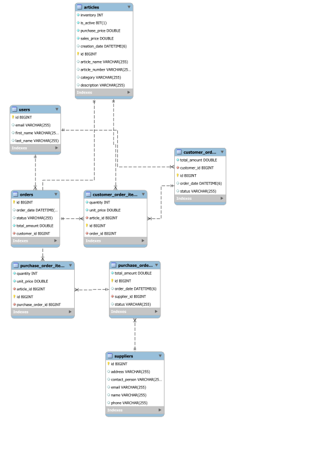

## Auftragsmanagement-System "Auftragscockpit"


## 📦 Auftragsmanagement-System

Ein modular aufgebautes, webbasiertes Verwaltungssystem für Kunden, Artikel, Lieferanten, Bestellungen und Kundenaufträge.
Das Projekt dient als zentrale Plattform, um betriebliche Bestell- und Auftragsprozesse digital, transparent und effizient abzubilden.

## 🚀 Funktionsübersicht

Das System stellt eine Vielzahl an Kernfunktionen bereit, die typische Unternehmensprozesse abdecken.

## 👥 Kundenverwaltung

- Kunden anlegen (Vorname, Nachname, E-Mail)
- Kunden bearbeiten (Vorname, Nachname, E-Mail)
- Kunden löschen
- Übersicht aller Kunden in tabellarischer Darstellung

## 📦 Artikelverwaltung

- Artikel erstellen (Aritkelnummer, Name, EK, VK, Kategorie, Lagerbestand, Beschreibung, Ist Artikel aktiv?)
- Artikel bearbeiten
- Artikel löschen
- Automatische Margenberechnung (Deckungsbeiträge)
- Prüfung von Lagerbeständen
- Export der Artikelübersicht als PDF

## 🏭 Lieferantenverwaltung

- Lieferanten anlegen (Firmenname, Ansprechpartner, E-Mail, Telefon, Addresse)
- Lieferanten bearbeiten
- Lieferanten löschen
- Detaillierte Anzeige aller Informationen zu einem Lieferanten ("Details")
- Verwaltung von Kontaktdaten und Stammdaten

## 🛒 Bestellwesen (Beschaffungsprozesse)

- Erfassen von Bestellpositionen
- Erstellen und Absenden von Bestellungen
- Validierungslogiken (Mindestmenge, Lagerbestand, doppelte Artikel)
- Automatische Bestellnummernvergabe

## 📑 Kundenaufträge

- Kundenaufträge erstellen und verwalten
- Validierung der Bestellpositionen (Auswahl mind. 1 oder mehrere)
- Festlegung des Auftragsstatus (NEU → AUSGELIEFERT)
- Automatische Lagerbestandsanpassung bei Auslieferung
- Ereignisbasierte Verarbeitung (Logging, Bestandsänderung)

## 🎯 Zielsetzung

Das Auftragsmanagement-System wurde entwickelt, um eine stabile, wartbare und langfristig erweiterbare Plattform für betriebliche Prozesse zu schaffen.  
Im Fokus stehen:

- **Hohe Datenqualität** durch strukturierte, konsistente und valide Datenhaltung  
- **Prozesssicherheit** durch klar definierte und nachvollziehbare Abläufe  
- **Benutzerfreundlichkeit** dank einer schlanken, performanten Weboberfläche  
- **Skalierbarkeit** für zukünftige Funktionsbereiche (z. B. Logistik, Reporting, Rollen- und Rechteverwaltung)  
- **Nachhaltige Softwarearchitektur** durch modularen Aufbau und Wiederverwendbarkeit einzelner Komponenten  

## Entity-Relationship-Diagramm

[](src/main/resources/static/Entity-Relationship-Diagramm.svg)

## 🛠️ Technologie-Stack

| **Rolle / Bereich** | **Technologie** | **Version / Typ** | **Hinweis** |
| :--- | :--- | :--- | :--- |
| **Backend** | Java | 17 | Zentrale Programmiersprache des Backends. |
| **Backend** | Spring Boot | REST-API, DI/IoC, JPA | Grundlage für API, Dependency Injection und Persistenz. |
| **Backend** | Spring Data JPA | – | Vereinfachte Datenbankabstraktion für JPA. |
| **Backend** | OpenPDF | – | Generierung von PDF-Dokumenten im Server. |
| **Frontend** | HTML | 5 | Strukturierung der Weboberfläche. |
| **Frontend** | CSS | 3 | Gestaltung und Styling des UI. |
| **Frontend** | JavaScript | – | Interaktivität und dynamische Inhalte. |
| **Frontend** | Grid-basiertes UI-Layout | – | Layout-Strukturierung für responsives Design. |
| **Frontend** | Integration externer Dienste | YouTube, Google Maps via iFrame | Einbindung externer Inhalte. |


## 🔧 Installation & Setup

Repository klonen:
```bash
git clone https://github.com/SMABFWS124A/Auftragsmanagement
```

Mit einer IDE der Wahl (IntelliJ, Eclipse, VS Code) öffnen, Maven Dependencies laden, Spring Boot Anwendung starten
=> Browser öffnen und die Schnittstellen bzw. HTML-Oberfläche aufrufen über: http://localhost:8080/login.html

Anmeldedaten:

| Rolle | Benutzername / E-Mail | Passwort | Hinweis | 
| :--- | :--- | :--- | :--- | 
| **Testbenutzer** | `test@test.de` | `Test123` | Vollständiger Zugriff auf alle Verwaltungsbereiche  für Testzwecke. | 

## 📅 Geplante Erweiterungen

- Rollen- und Rechtemanagement (RBAC)
- Erweiterte Lagerbestandsüberwachung
- Automatisierte Mailbenachrichtigungen
- Dashboard mit Diagrammen und KPI-Analysen
- Volltextsuche in Artikeln und Kunden
- (Weitere) Exportfunktionen (PDF, CSV, Excel)

## Use Cases:
[Use Cases - Auftragscockpit (PDF)](https://github.com/SMABFWS124A/Auftragsmanagement/blob/main/src/main/resources/static/Use%20Cases%20-%20Auftragscockpit.pdf)

## Architektur-, Muster- und Integrationsdokumentation
Eine detaillierte Beschreibung der Architektur des Auftragscockpits finden Sie hier:

[Architektur - Auftragscockpit (PDF)](https://github.com/SMABFWS124A/Auftragsmanagement/blob/main/src/main/resources/static/Architektur%20-%20Auftragscockpit.pdf)
____________________________________________

Viel Spaß beim Benutzen und Testen der Anwendung!


